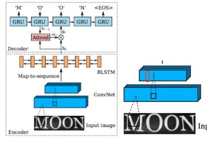
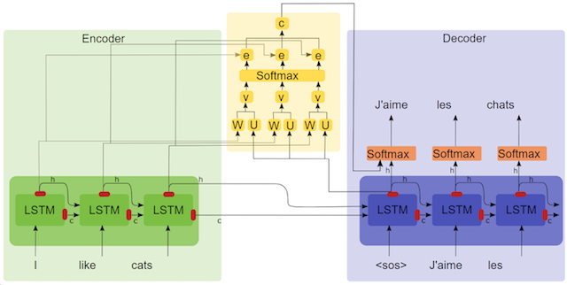

# 注意力模型识别OCR

这个是基于[@thushv89](https://github.com/thushv89/attention_keras)的注意力模型的基础上，添加了OCR的功能，为了表示尊敬，直接fork了他。

但是，实际上我在他的基础上要添加OCR识别，参考的论文是
《Robust Scene Text Recognition with Automatic Rectification（RARE）》中的SRE网络。



# 算法实现思路

## 1.输入图像的特征化
本来打算直接用个vgg之类的backbone当做特征抽取的过程，即抽取后，reshape成所需要的序列输入的样子，比如7x7x512=>7x3584，结果后来了问题，虽然不用非要按照他的输入为224x224，而是就是直接resize成32高，恩，是的，高还是要统一的，然后输出的高度应该是Bx1xNx512，但是，N一般会很小，因为VGG都是宽高都缩成1/32，这个就不好办了，比如一个32x100的图片，缩成了1x3个feature map。3个，我怎么也不能搞出来5个字啊。你序列可以长点，但是你不能比要预测的还少啊。所以，只好放弃vgg了。

然后只好用crnn项目中卷积网络，那个卷积，宽只会变成1/4，而高可以变成1/32，这样就可以变成一个 [1, W/32, 512]的一个特征序列了，然后就可以灌给Bi-GRU了。

## 2.Bi-GRU Encoder

这个没啥，就是一个标准的双向GRU编码器，注意这个属性就可以：`return_sequences=True`，毕竟要返回一个完整的序列，而不是仅仅最后一个状态。

## 3. GRU解码器

注意他的隐含层是编码器的2倍这个细节，毕竟Bi-GRU是前向和后向concat一起的结果嘛。

## 4.注意力编码器了

是[@thushv89](https://github.com/thushv89/attention_keras)开发的注意力模型，细节上也没啥，主要是里面用了两个k.rnn，关于K.rnn函数，读代码时候会遇到，参考[这个](https://kexue.fm/archives/5643/comment-page-1)，其实核心就是把一个序列生成事儿，转化成一个循环执行的函数了。代码也不难，细看也容易明白，就不赘述了。



## 5. 最后的输出

最后呢，是把attention输出的内容和解码器GRU的输出，concat一起，扔给一个TimeDistributed，其实就是一个共享的全连接，输出一个3770（词表）大小的分类就完事了。

# 设计中的纠结和问题

最后的实现，看上去简单简洁，其实经历过多次的纠结和趟坑，记录下来，害怕忘却。

## 思路转变的痛苦

说说我的整个思考历程，

最开始，就是觉得照着SRE的网络结构撸就可以，找到了thushv89的注意力模型，就想，前面接一个vgg，做特征抽取，灌给一个seq2seq，然后结合上thushv89的注意力，完事。

开始，就是vgg，VGG的放弃，就不多说了，上面谈到了已经。就是因为宽度不够。只好换成了[crnn](https://github.com/piginzoo/crnn)中的Conv卷积网络，得到了一个[1,Width/4,512]的序列。

然后，就交给attention+seq2seq吧，也没觉着多难，人家thushv89给的例子中，有代码啊，于是拷贝过来，跑了一一下，虽然也遇到问题，不过，还是通了。

然后，就开始纠结mask问题了。

输入的时候，虽然我把图片都resize成高度为32，宽度依据高度调整自动调整了，但始终是不一样的，之前在我的[crnn](https://github.com/piginzoo/crnn)中，由于我解决不了卷基层可以支持变长sequence的问题，我就改用保持形状的padding（即高度32，宽度调整后，后面加padding），这次，我用keras实现，发现keras里面有个masking层，于是觉得，是不是可以试试呢。

后来发现，需要mask的玩意有2个：
- 图片，准确说，是最开始卷积开始的时候就需要masking；然后卷积完的特征序列，还需要mask后，才好意思灌给bi-gru
- 文字，被识别的文字也是参差不齐的，也需要masking呀，过去在crnn里面，用tensorflow的**sequence_length**,在keras对应就是masking。

```
rnn.stack_bidirectional_dynamic_rnn(fw_cell_list, bw_cell_list, inputdata,sequence_length=sequence_len,dtype=tf.float32)
```

于是，尝试用masking，

首先是卷积层根本就不支持masking，所以，一开始的input就masking之的幻想破灭。

然后，那我就尝试，卷积之后用个lambda来做padding吧，然后尝试套个mask给他：
```bash
def padding_wrapper(conv_output):
    paddings = [[0, 0], [0, 50 - tf.shape(conv_output)[0]],[0,0]]
    conv_output_with_padding = tf.pad(conv_output, paddings=paddings)
    conv_output_with_padding.set_shape([None, 50, 512])  # 靠！还可以这么玩呢！给丫设置一个shape。
    return conv_output_with_padding
    
conv_output_with_padding = Lambda(padding_wrapper)(conv_output);
```
这个算是过了，可是，再往后，这玩意还要往后传，传到attention里面以后，attention里面又报错，说不支持masking了。

后来，我理解，masking的本意是用一个特殊的值来标识，这些值不参与运算，用来解决类似于seqence长度不一的情况，但是，这个masking一旦某一层开始实施，就得要求后续的层也需要支持，一般都是要在构造函数里面加上`self.supports_masking = True`，还要在call的时候，加入入参mask等等。

也就是说，我还要调整attention的相关代码，来适应masking，而这个调整动静有些大，我需要修改各个k.rnn的能量函数啥的，都要改，我权衡了一下，算了，放弃了。

最后，我又回到老路上，老老实实的定义一个最大宽度，然后加如padding，而且还是用的标准的tensorflow的tf.pad_seqence的方式。


## 遇到的版本的坑

### 坑1：不要混用keras和tf.keras的代码

争取的代码为：
```
from tensorflow.python.keras.models import Model
from layers.attention import AttentionLayer
from tensorflow.python.keras.utils import to_categorical
```

如果混用，如下代码
```
from keras.layers import Bidirectional,Input, GRU, Dense, Concatenate, TimeDistributed,Reshape
from tensorflow.python.keras.applications.vgg19 import VGG19
from keras.applications.vgg19 import VGG19
```

就会报错：
 ```
 AttributeError: 'Bidirectional' object has no attribute 'outbound_nodes'
 ```
 
原因是不能用keras自带的vgg19+keras自带的bidirectional，靠，肯定是版本不兼容的问题切换到下面的就好了，之前还是试验了用tf的bidirectional+keras的vgg19，也是不行，报错：AttributeError: 'Node' object has no attribute 'output_masks'

靠谱的组合是：tf的bidirectional+tf的vgg19

```
from tensorflow.python.keras.applications.vgg19 import VGG19
from tensorflow.python.keras.layers import Bidirectional,Input, GRU, Dense, Concatenate, TimeDistributed,Reshape
```
是的，全部都替换成tensorflow里面的keras的东东就可以了。

### 坑2：seq2seq中的坑

seq2seq的实现中，也有很多细节的坑

- masking，不是说，不计算后面的值了，而是后边的输出值不变了。比如：
```
test_input = np.array([
    [[1, 1, 1], [1, 1, 1], [1, 1, 1], [1, 1, 1]],
    [[2, 2, 2], [2, 2, 2], [0, 0, 0], [0, 0, 0]],
    [[3, 3, 3], [0, 0, 0], [0, 0, 0], [0, 0, 0]]], dtype=int)
mask = Masking(mask_value=0)
gru = GRU(
    1,
    return_sequences=True,
    activation=None,
    recurrent_activation=None,
    kernel_initializer='ones',
    recurrent_initializer='zeros',
    use_bias=True,
    bias_initializer='ones'
)
x = Input(shape=test_input.shape[1:])
m1 = Model(inputs=x, outputs=gru(x))
print(m1.predict(test_input).squeeze())
结果：
[[  -12.   -60.  -252. -1020.]
 [  -42.  -336.  -336.  -336.]
 [  -90.   -90.   -90.   -90.]]
``` 
看，mask起作用了，看来后面的就没有再计算了，依然保持输出值。

- 这个seq2seq和注意力的结合中并没有再次输入attention结果到解码GRU的输入，而是直接和解码器GRU的输出concat到一起，然后就做全链接分类了。

# 实现中的trick

谈谈具体实现中的一些细节，

## 训练数据的加载

这次尝试了Keras的Sequence，我们都知道，Keras的数据输入有3中方式，一种是全部加载全体数据；一种是ImageGenerator；还有一个Sequence类的实现。

对应到训练的时候，又可以对应fit、fit_generator和train_on_batch，该如何选择呢呢？
[这篇文章](https://www.twblogs.net/a/5c226c9fbd9eee16b3db025b)讲的明白：
>在99％的情況下，您不需要對訓練深度學習模型進行如此精細的控制。相反，您可能只需要自定義Keras .fit_generator函數。

恩，我就用fit_generator了。

另外，ImageGenerator不是为了加载数据用的，是为了做数据增强用的，虽然可以那么用，
另外，在model.fit_generator里面可以用迭代器，但是无法迭代器方式无法开启多进程，
最佳姿势是：Sequence+多进程：
```python
D = SequenceData('train.csv')
model_train.fit_generator(generator=D,
    steps_per_epoch=int(len(D)), 
    epochs=2, 
    workers=4, 
    use_multiprocessing=True, 
    validation_data=SequenceData('vali.csv'),
    validation_steps=int(20000/32))  
```

在构造函数里面，调用initialize方法，完成整体图片文件名的加载，（不加载数据），然后在__getitem__方法，一批批的从磁盘上读取数据，而且，框架帮我控制内部的进程数，很好很好，我很满意。

## seq2seq的数据准备

谈谈标签数据吧，就是一个个的字符串嘛，但是，对seq2seq的解码器GRU来说，他的输入和输出是啥呢？

输入是一个字符串，开始是BOS，然后是第一个字符，第二个字符。。。。
输出是一个字符串，和输入一样的，但是，但是，第一个输出没有BOS，而是从第一个字符开始的，最后一个输出是EOS。

所以，需要在绑定输入和输出的时候，调整一下：
```python
model = Model(inputs=[input_image, decoder_inputs], outputs=decoder_pred)
--------------------------------
return [images,labels[:,:-1,:]],labels[:,1:,:]
```

# 跑一跑原作者的例子

作者的代码目前被转移到test/examples目录下了。

为了加深attention的理解，可以跑原作者的Attention的例子：

`python -m examples.nmt_bidirectional.train`
要跑的话，需要先准备数据：
```
cd data
tar -xvf small_vocab_en.txt.gz
tar -xvf small_vocab_fr.txt.gz
```
---

